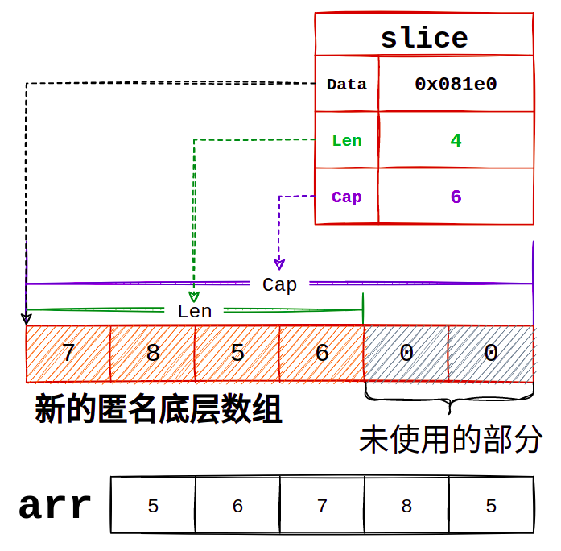
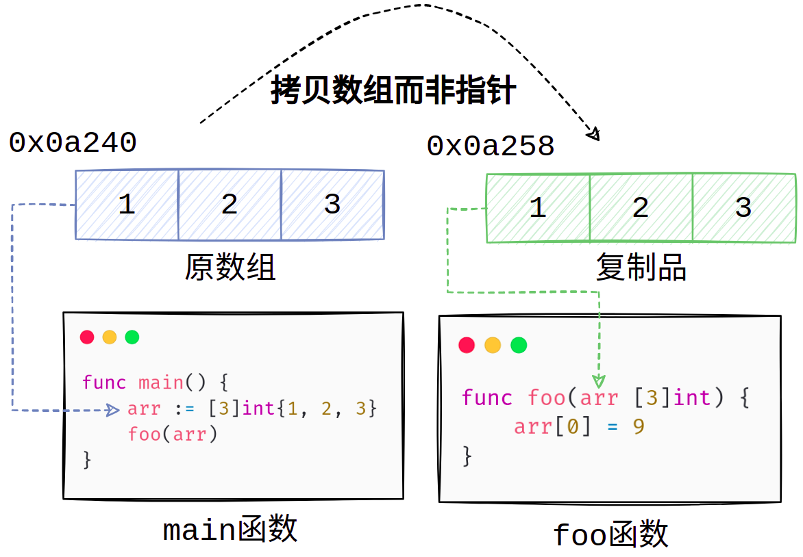
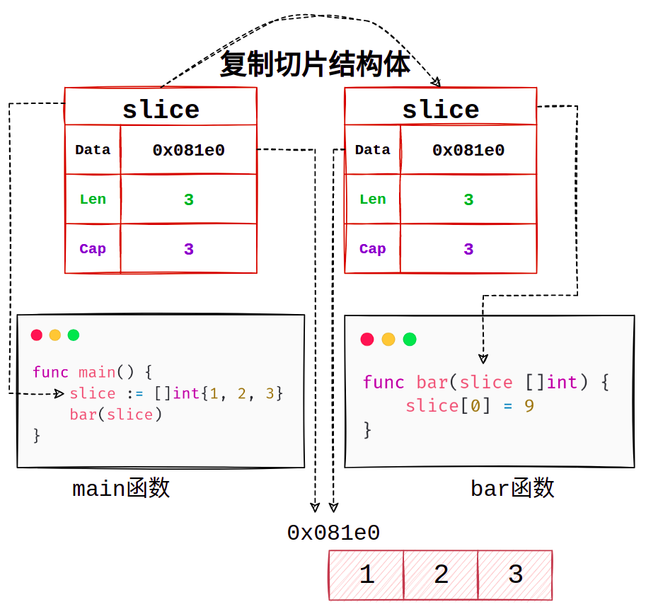
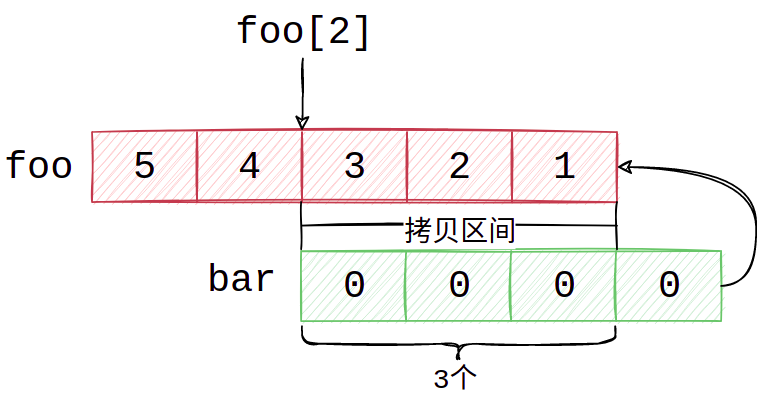

Go slice剖析
===
[切片(slice)](https://go.dev/ref/spec#Slice_types "Go Specification Slice types")类似数组，都是一段相同类型元素在内存中的连续集合。和数组不同的是，切片的长度是可以动态改变的，而数组一旦确定了长度之后就无法再改变了。

## 切片的创建和使用
#### 创建
要创建一个切片，我们可以使用以下几种方式
 - 使用关键字make()创建切片
 - 使用[切片表达式](https://go.dev/ref/spec#Slice_expressions "Slice expressions")从切片或数组构造切片
 - 使用字面值显式初始化切片
```Go
a := make([]int,3,5) // 使用make关键字
b := a[1:3]          // 使用切片表达式
c := []int{1,2,3}    // 使用字面值显式初始化
```
  
#### 使用
切片的使用方式类似数组，都是通过下标访问对应的元素：
```Go
// 使用字面值初始化切片
foo := []int{5,6,7,8,9}
f1 := foo[0] // f1 = 5
f2 := foo[1] // f2 = 6
f3 := foo[4] // f3 = 9 #注意这里的值#

// 使用切片表达式从切片foo上创建新切片bar
bar := foo[2:4]
b1 := bar[0] // b1 = 7
b2 := bar[1] // b2 = 8
// b3 := bar[2] 出错,panic: runtime error: index out of range [2] with length 2

// 对切片进行操作
bar = append(bar,10) // 向slice末尾内追加元素
b3 := bar[2] // b3 = 10 # 注意这里的值
f3 = foo[4]  // f3 = 10 #和上面的f3比较一下#
foo[4] = 9   // 更改foo[4]的值
b3 = bar[2]  // b3 = 9  #和上面的b3比较一下#
```
我们并没有对`foo`进行修改，我们只是在`bar`后面添加了一个元素10，为什么`foo`的内容也发生改变了呢？后面我们修改了`foo[4]`，为什么`bar`刚刚追加的10变成了9?是不是它们用的是同一块地址空间？

在回答这些问题之前，让我们先看看切片的结构。
## 切片的运行时结构
切片在运行时的表示为`reflect.SliceHeader`，其结构如下
```Go
type SliceHeader struct {
	  Data uintptr // 底层数组的指针
  	Len  int     // 切片的长度
	  Cap  int     // 切片的容量
}
```
我们可以发现，切片本身并没有“存储数据”的能力，它"肚子里“有一个指针,这个指针指向的才是真正存放数据的数组。当我们使用`make([]int,3,5)`来创建切片时，编译器会在底层创建一个长度为5的数组来作为这个切片存储数据的容器，并将切片的Data字段设为指向数组的指针。  

我们可以使用如下方法来将一个切片转换为`reflect.SliceHeader`结构:
```Go
// 初始化一个切片
slice := make([]int, 3, 5)
// 将切片的指针转化为unsafe.Pointer类型，再进一步将其转化为reflect.SliceHeader
sliceHeader := (*reflect.SliceHeader)(unsafe.Pointer(&slice))
// 打印切片的属性
fmt.Printf("Data:%p\n",unsafe.Pointer(sliceHeader.Data)) // Data:0xc0000181e0
fmt.Printf("Len:%v\n",sliceHeader.Len) // Len:3
fmt.Printf("Cap:%v\n",sliceHeader.Cap) // Cap:5
```  
  
通过这种方法，我们可以很容易的观察使用切片表达式创建切片和原数组的关系:
```Go
// 初始化一个数组
arr := [3]int{1, 2, 3}
// 使用切片表达式在数组arr上创建一个切片
slice := arr[0:2]
sliceHeader := (*reflect.SliceHeader)(unsafe.Pointer(&slice))
fmt.Printf("Data:%p\n", unsafe.Pointer(sliceHeader.Data)) // Data:0xc0000b8000
fmt.Printf("Arr:%p\n",&arr) // Arr:0xc0000b8000
fmt.Printf("Len:%v\n", sliceHeader.Len) // Len:2
fmt.Printf("Cap:%v\n", sliceHeader.Cap) // Cap:3
```
我们可以发现，切片的Data字段和数组的指针是相同的，说明切片和数组共用的是同一块内存空间。

## 切片的内存结构
说了这么多，切片究竟长什么样子呢？  

我们拿下面这段代码来做个示范：
```Go
// 初始化一个长度为5的数组
arr := [5]int{5, 6, 7, 8, 9}
// 使用切片表达式在arr上构建一个切片
slice := arr[2:4]
```
数组arr和切片slice的结构如下图所示：

  
我们结合代码来解读一下这张图，
- `arr`是一个由**5**个元素组成的**数组**，它们在内存中是**连续**的。  
- `slice`是使用切片表达式`arr[2:4]`来构建的

所以`slice`的内容是数组`arr[2]`到`arr[4]`中间的这部分(从2开始但并不包括4)。

也就是说，`slice`的`Data`字段指针指向的是`arr[2]`的位置,**当前slice里有两个元素**（4 - 2 = 2），`slice[0]`的值是7，`slice[1]`的值是8。
```Go
fmt.Println(slice[0]) // 7
fmt.Println(slice[1]) // 8
```
那`Cap`为什么是3呢？

因为`slice`的底层数组，也就是`arr`依然有额外的空间供`slice`使用，目前`slice`只包括了`7`和`8`两个元素，但如果需要添加新的元素进`slice`里，那么9这个元素的空间就可以供`slice`使用。  

我们可以查看汇编验证一下是否正确
```Go
...
// 初始化部分
LEAQ type.[5]int(SB), AX
CALL runtime.newobject(SB) // 在堆上分配内存
MOVQ $5, (AX)   // arr[0] = 5
MOVQ $6, 8(AX)  // arr[1] = 6
MOVQ $7, 16(AX) // arr[2] = 7
MOVQ $8, 24(AX) // arr[3] = 8
MOVQ $9, 32(AX) // arr[4] = 9
// Slice相关逻辑
ADDQ $16, AX // Data = &arr[2],AX寄存器指向的是arr[0]，将其加16字节，也就是向后移动两个元素
MOVL $2, BX  // Len = 2
MOVL $3, CX  // Cap = 3
...
```
总结一下，`Data`指针指向`slice`截取的第一个数据，`Len`代表`slice`当前有多少个元素，`Cap`表示`slice`最多可以容纳的元素数量，超过`Cap`之后就需要扩容了。

所以现在我们可以解决开始的问题了：如果使用**切片表达式**在别的切片或数组上构建切片，那么**它们共享的是同一块内存空间**，只不过`Data`,`Cap`,`Len`的数据不一样，**如果修改其中某一个元素，其他切片或数组也会受到影响**。
## 切片的扩容
切片本身并不是一个动态数组，那么它是如何实现动态扩容的呢？

我们依然拿上面的例子讲解
```Go
arr := [5]int{5, 6, 7, 8, 9}
slice := arr[2:4]
// 当前slice属性 Len:2,Cap:3
// 向slice内追加元素
slice = append(slice,5) // 此时slice为[7,8,5]
// 当前slice属性 Len:3,Cap:3
```
在我们使用`append`向`slice`内追加1个元素后，底层的`arr`数组其实已经没有额外的容量能够让我们再一次追加数据了,此时的`slice`如图所示：


现在我们再次`append`一个元素看看会发生什么事情
```Go
// 接前面
// 在底层数组没有空间的情况下再次追加元素
slice = append(slice,6)

// arr 此时的值
fmt.Printf("%#v\n",arr) // [5]int{5, 6, 7, 8, 5}
// slice 此时的值
fmt.Printf("%#v\n",slice) // []int{7, 8, 5, 6}

// arr的地址
fmt.Printf("%p\n",&arr) // 0x081e0
// slice Data的值以及Len和Cap
sliceHeader := (*reflect.SliceHeader)(unsafe.Pointer(&slice))
fmt.Printf("Data:%p\n", unsafe.Pointer(sliceHeader.Data)) // 0x08210
fmt.Printf("Len:%v\n", sliceHeader.Len) // Len:4
fmt.Printf("Cap:%v\n", sliceHeader.Cap) // Cap:6
```
观察输出你会发现，`slice`的`Data`字段已经和`arr`的值**不一样**了，说明**此时`slice`的底层数组已经不是`arr`了**,我们使用以下命令禁用优化和内联进行编译，并查看对应的汇编代码,再次验证一下：
```SH
GOSSAFUNC=main.grow go build -gcflags "-N -l" slice.go
```
**源代码**:

  

**最终生成的汇编代码**:

  

仔细观察我们发现，源代码第7行所对应的汇编指令中，有一行`CALL runtime.growslice`,这个函数定义在`runtime/slice.go`文件中，函数签名如下
```Go
func growslice(et *_type, old slice, cap int) slice
```
该函数传入**旧的slice**和**期望的新容量**，返回**新的`slice`**,让我们看看函数的具体实现：
```Go
func growslice(et *_type, old slice, cap int) slice {
    // 省略了部分代码
    newcap := old.cap
    // doublecap为旧切片容量的2倍
    doublecap := newcap + newcap
    // 如果期望容量 > doublecap,则直接将期望容量作为新的容量
    if cap > doublecap {
        newcap = cap
    } else {
        // 判断旧切片的容量，如果小于1024，则将旧切片的容量翻倍
        if old.cap < 1024 {
            newcap = doublecap
        } else {
            // 每次增长1/4,直到容量大于期望容量
            for 0 < newcap && newcap < cap {
                newcap += newcap / 4
            }
            // 如果旧切片容量小于等于0，则直接将期望容量作为新容量
            if newcap <= 0 {
                newcap = cap
            }
        }
    }
    // 省略了部分代码
}
```
在本例中，我们向`growslice`函数传入的`cap`为`4`(因为旧的`slice`本身有3个元素，再次`append`1个元素,所以期望容量是`4`,为了印证这一点，我们可以观察对应的汇编代码，在`Go 1.17`之后的版本里，x86平台下函数调用使用寄存器来传递函数的参数，寄存器`AX`传递第一个参数,参数二的`runtime.slice`是个结构体，有三个字段，占用3个寄存器，所以`BX`，`CX`，`DI`寄存器是第二个参数，`SI`寄存器为`cap`，仔细看调用前的准备工作`MOVL $4, SI`,印证了我们之前说传入的`cap`为4的说法）,`cap`传入4之后我们向下走，`4 < 2 x 3`，不满足 `cap > doublecap`，继续向下走，到`old.cap < 1024`时条件满足，所以新的容量就等于旧的容量翻倍，也就是`2 x 3 = 6`。

但**上述部分得到的结果并不是真正的新切片容量**，为了提高内存分配效率，减少内存碎片，会在这个newcap的基础上**向上取整**，取整的参考是一个数组，位置在`runtime/sizeclasses.go`中，数组内容如下：
```Go
var class_to_size = [_NumSizeClasses]uint16{0, 8, 16, 24, 32, 48, 64, ..., 32768}
```
上面我们计算的`newcap`为6，每个`int`占用8字节，共计`6 x 8 = 48`字节，正好在这个数组中，不需要再向上取整，如果我们刚刚计算的`newcap`为5，`5 x 8 = 40`字节，需要向上对齐到`48`字节，于是最终的新切片大小就为`6`个元素而不是`5`个。 

到这里我们已经计算出我们新切片的所有数据了，`Len:4`，`Cap:6`。怎么样？是不是和上面代码的输出一样呢？现在我们再来看看新切片的内存结构图：





`slice`现在引用了一个新的数组，现在的`slice`和`arr`已经**没有关系**了。

值得注意的是，切片扩容后灰色的部分暂时未使用，这部分是留给下次`append`时使用的，避免频繁扩容带来的复制和内存分配的开销。
  
## 切片的传递
我们之前提到过，Go中的参数传递都是**值传递**[](https://go.dev/doc/faq#pass_by_value "pass by value")。但如果你有过一些Go语言的经验，可能会遇到下面这种情况：
```Go
// foo 尝试把数组的第一个元素修改为9
func foo(arr [3]int) {
    arr[0] = 9
}

// bar 尝试把切片的第一个元素修改为9
func bar(slice []int) {
    slice[0] = 9
}

func main() {
    arr := [3]int{1, 2, 3}
    slice := []int{1, 2, 3}
    foo(arr)           // 尝试修改数组
    bar(slice)         // 尝试修改切片
    fmt.Println(arr)   // [1 2 3]
    fmt.Println(slice) // [9 2 3]
}
```
我们对`arr`的修改在`main函数`中是**不可见**的，这符合我们刚刚提到的:一切参数的传递都是值传递，我们在`foo`中修改的只是`arr`的一个**副本**，真正的`arr`并没有被修改，除非我们将`foo`函数的参数修改为指针类型。但`slice`的修改却影响到了`main函数`中的`slice`,这是为什么呢？难道切片是引用传递而非值传递吗？

其实不是的，我们上面说了，**一切参数传递都是值传递**，`slice`当然也不例外 ，结合我们刚刚了解的`slice`的结构，我们在向`bar`中传递参数时，是**将`slice`的结构体拷贝了一份而并非拷贝了底层数组本身**，因为`slice`的结构体内持有底层数组的指针，所以在`bar`内修改`slice`的数据会将底层数组的数据修改，从而影响到`main函数`中的`slice`。

下面我用两幅图向你展示参数传递时复制的内容：


 
上面这幅是我们调用`foo`函数时的情景，我们复制了一个**数组**后传入了`foo`函数，`foo`函数内的`arr`和main函数内的`arr`除了里面的元素相等之外**没有任何关系**，它们不是同一块内存空间，所以我们在`foo`函数内修改数组`arr`并不会影响main函数的`arr`。

接下来我们再看一下当我们调用`bar`时的情景：


当我们调用`bar`函数时，复制的是**切片的结构体**，也就是`Data`，`Len`，`Cap`这三个属性。此时`bar`函数内的`slice`和main函数内的`slice`持有的是同一个数组的指针，所以我们在bar函数内对`slice`所做的修改会影响到main函数中的`slice`。

那是不是可以认为，我们在任意场景下都可以传递`slice`到别的函数？反正里面有指针，做的修改都能在函数外面“看到”呀？

那我们稍微修改一下上面代码中的`bar`函数：
```Go
// bar 尝试在slice后追加元素
func bar(slice []int) {
    slice = append(slice,4)
}

func main() {
    slice := []int{1, 2, 3}
    bar(slice)         // 追加元素
    fmt.Println(slice) // [1 2 3]
}
```

为什么我们在`bar`内追加了元素，但main内没发生变化？


我们知道，`bar.slice`是`main.slice`的**复制**，起初`bar.slice`和`main.slice`的`Data`是**相同**的,它们指向同一块内存地址，但我们在`bar`函数内向`bar.slice`追加了元素，由于`slice`底层的数组只能容纳3个元素，所以`append`操作会**触发扩容**，**导致`bar.slice`指向新的数组**，而`main.slice`指向的依然是旧的数组，所以我们在`bar`内的`append`操作不会影响main函数内的`slice`。

**思考**
- 如果上述例子中`main.slice`的`Len`为3,`Cap`为4,那么调用`bar`函数进行`append`操作，`main.slice`会受到什么影响吗？

## 切片的复制

切片使用内建函数`copy`进行复制，`copy`将元素从源切片(`src`)复制到目标切片(`dst`),返回复制的元素数。
```Go
// copy 的函数签名
func copy(dst, src []Type) int

// copy的使用
foo := []int{5, 4, 3, 2, 1}
bar := []int{0, 0, 0, 0}

// 将bar复制到foo，从foo[2]开始
i := copy(foo[2:], bar)
fmt.Printf("%v\n",foo) // [5 4 0 0 0]
fmt.Printf("%d\n",i)   // 3
```
上面代码的行为如下图所示：



我们`copy`的`dst`是从`foo[2]`开始的，所以`copy`只会将`foo[2]`,`foo[3]`,`foo[4]`使用`bar`进行替换，由于只复制了3个，所以`copy`返回3

`copy`会在编译时进行展开，底层调用`runtime.memmove`函数将整块内存进行拷贝。相较于平时我们使用for循环进行逐个复制，copy能够提供更好的性能。