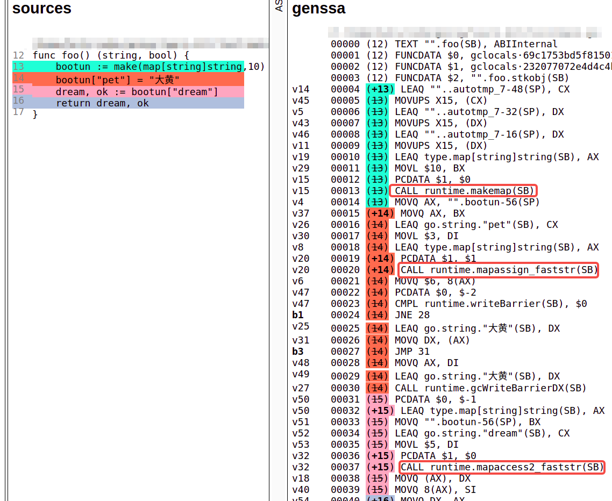

如何寻找内建函数源码位置
===
你有没有遇到过下面这些问题：
 - 想查看Go内建函数的实现,IDE跟踪进去后却发现只有函数声明，没有实现代码
 - 想了解不同的写法Go编译器是如何进行处理的
 - 内建函数被展开之前和之后都做了些什么工作
 - 看程序的汇编代码时，同样都是`make(map)`,怎么有时候会被翻译为`runtime.makemap`，有时候却什么都找不到

本篇文章可以帮助你解决这些问题。   

**为了帮助基础薄弱的同学，每个小节都会加上实际的代码进行分析。**  

注：本文写作时的Go版本为：  
`go version go1.17.5 linux/amd64`。
# 查看Go内建函数的实现
初学Go时，你是否好奇过make函数的实现
```go
// make slice
slice := make([]int,20)
// make channel
channel := make(chan int,3)
```
这个神奇的函数能用来创建好多东西，但当你在IDE里点进去后，却发现它只有一行函数声明：
```go
func make(t Type, size ...IntegerType) Type
```
于是你的探索就止步于此了...

现在让我们看看，有哪些寻找内建函数的源码：
### 方法1:使用汇编
**场景代码**

```go
// foo.go
func foo()[]int {
    slice := make([]int, 3)
    return slice
}
```

**查看方式**  
使用以下方式查看`foo.go`的汇编指令
```shell
$ go tool compile -S foo.go
```
下方是该命令生成的结果(省略了部分)
```c
...
0x0023 00035 (./foo.go:4) PCDATA  $1, $0
0x0023 00035 (./foo.go:4) CALL    runtime.makeslice(SB)
0x0028 00040 (./foo.go:5) MOVL    $3, BX
...
```
我们要找的答案就在`CALL runtime.makeslice`这一行，说明我们的`make([]int,3)`最后调用的是`runtime.makeslice`函数(当然，除了这个函数外，编译器也做了一些别的工作，我们后面会介绍。)

或者使用反汇编将编译好的文件重新转换为汇编指令：
```shell
$ go tool objdump -s "foo" foo.o
```
标志`-s`支持正则表达式，动手试一下寻找上文的`runtime.makeslice`吧！

这里你可能会疑惑，`foo.o`这个文件是怎么出现的?  

`foo.o`其实是上一步`go tool compile`的产物，在实际使用中，你可以用`go build xx.go`后的`xx.exe`来代替`foo.o`。(这里可能有点绕口，意思就是你可以直接`go build main.go`，然后会生成一个`main.exe`，再使用`go tool objdump -s "main\.main" main.exe`就可以查看main函数对应的汇编指令了)。

经常会有人问，`go tool compile -s`和`go tool objdump`产生的汇编有什么区别？仔细观察两个命令的输出可以发现，`go tool compile`生成的是还未链接的汇编指令，只有偏移量，并未赋予实际的内存地址。而`go tool objdump`由于是从编译好的二进制文件反汇编而成的，所以是有这些东西的。

### 方法2:查看SSA
**场景代码**

```go
// main.go
func foo() (string, bool) {
    // 大小尽量大一些，否则如果map分配到栈上，后面的内容可能对不上
    bootun := make(map[string]string,10)
    bootun["pet"] = "大黄"
    dream, ok := bootun["dream"]
    return dream, ok
}
```

**查看方式** 
```shell
$ GOSSAFUNC=foo go build main.go
```
该命令在目录下生成一个`ssa.html`，里面记录着数十个SSA的优化过程以及最终的SSA：


我们可以点击源码进行颜色标记，其他阶段对应的代码位置也会标记上相应的颜色。如下图所示:


我将几个关键的指令用红框圈了出来。可以看到，`make([]int, 10)`变成了`runtime.makemap`,对map的赋值底层调用了`runtime.mapassign`函数，两个返回值的map访问底层调用了`runtime.mapaccess2`函数，该函数有**两个**返回值(对，你猜没错，单返回值调用的是`runtime.mapaccess1`,该函数只有一个返回值,访问map的两种方式其实对应了不同的函数，这只是Go提供给我们的语法糖罢了)。

### 方法3:跟踪Go编译器源码
**场景代码**
```go
func foo() ([]int,[]int) {
    s1 := make([]int,10)
    s2 := []int{1,2,3,4,5}
    return s1,s2
}
```
**查看方式**  
这种方法需要你对**编译原理**和**Go编译器**有一些了解，不过别担心，跟着我一步一步走，我会带你了解内置函数翻译过程中的几个**主要节点**。

Go编译器源码的位置在`$GOROOT/src/cmd/compile/internal/gc`目录下(此处的gc指Go compiler)，入口函数是`/cmd/compile/internal/gc/main.go`中的`Main`函数，篇幅原因，这里我们只介绍上述代码所经过的几个关键节点，如果想详细了解Go编译过程，可以参考[《Go语言设计与实现》](https://draveness.me/golang/ "《Go语言设计与实现》")一书。

语法分析和类型检查的入口在上述`Main`函数的这一行：
```go
// Parse and typecheck input.
noder.LoadPackage(flag.Args())
```
这个函数内可以看到语法分析和类型检查的不同阶段：
```go
// Phase 1: const, type, and names and types of funcs.
// This will gather all the information about types
// and methods but doesn't depend on any of it.
//
// We also defer type alias declarations until phase 2
// to avoid cycles like #18640.
// TODO(gri) Remove this again once we have a fix for #25838.

// Don't use range--typecheck can add closures to Target.Decls.
base.Timer.Start("fe", "typecheck", "top1")
for i := 0; i < len(typecheck.Target.Decls); i++ {
    n := typecheck.Target.Decls[i]
    if op := n.Op(); op != ir.ODCL && op != ir.OAS && op != ir.OAS2 && (op != ir.ODCLTYPE || !n.(*ir.Decl).X.Alias()) {
        typecheck.Target.Decls[i] = typecheck.Stmt(n)
    }
}
```
无需阅读源码，通过注释我们就能看出来第一阶段处理的内容，因为代码相似，这里只展示第一阶段的代码。

此处我们只需要关注
`typecheck.Target.Decls[i] = typecheck.Stmt(n)`这行代码，这里是进入类型检查的入口，该函数其实是`cmd/compile/internal/typecheck/typecheck.go`下`typecheck`函数的包装函数，`typecheck`函数又会调用`typecheck1`函数,我们的要找的第一部分内容就在这里啦。  

`typecheck1`函数下有这样一处地方：
```go
case ir.OMAKE:
    n := n.(*ir.CallExpr)
    return tcMake(n)
```
表示当前处理的节点是`OMAKE`时的情景，让我们跟踪`tcMake`函数，看看里面都做了些什么：
```go
// tcMake typechecks an OMAKE node.
func tcMake(n *ir.CallExpr) ir.Node {
...
switch t.Kind() {
    default:
      base.Errorf("cannot make type %v", t)
    case types.TSLICE:
      ...
      nn = ir.NewMakeExpr(n.Pos(), ir.OMAKESLICE, l, r)
    case case types.TMAP:
      ...
    case types.TCHAN:
      ...
...
}
```
这里我们可以看到，`make`能够创建的类型在这里都有处理，我们只需要关注`slice`的逻辑，`tcMake`函数将当前节点的op更改为了`OMAKESLICE`以便于之后进一步的处理。

后面追踪起起来函数太多了，这里只放最后两个，第一个是处理op为`OMAKESLICE`时的场景：

```go 
func walkExpr1(n ir.Node, init *ir.Nodes) ir.Node {
  ...
  switch n.Op() {
    ...
  case ir.OMAKESLICE:
      n := n.(*ir.MakeExpr)
		  return walkMakeSlice(n, init)
  ...
}
```

第二个就是上面函数调用的`walkMakeSlice`函数：
```go 最终结果
// walkMakeSlice walks an OMAKESLICE node.
func walkMakeSlice(n *ir.MakeExpr, init *ir.Nodes) ir.Node {
    ...
    fnname = "makeslice"
    ...
}
```
PS:这个函数下面就是copy的walk函数，当时在[切片剖析](../2-slice.md)一节我们提到了copy函数底层调用了`memmove`,在这里也能看到。

此时我们终于看到，`make`在这里展开变为了`makeslice`，这个函数还有展开前后的处理，这里省略掉了。使用这个方法同样可以查看`map`或`channel`等类型的展开过程。


有了上述的这些方法，我们就可以愉快的查阅源码啦。

## 课后练习

### 1.奇怪的翻译机制
有时候你会发现，同样是`map/channel/slice`,同样是`make`函数，但是不同条件最终展开的代码可能并不一样。 
比如map有时会被展开为`runtime.makemap_small`，有时则是`runtime.makemap`,甚至有时候什么都没有(比如被分配到栈上)，查阅相关函数，看看究竟是哪些因素影响了这一结果。
### 2.slice字面值展开过程（较难）
**方法3**中我们只分析了`make(slice)`的展开过程，对于使用字面值初始化的方式我们没有解决，请试着寻找编译器对应的处理方法  
关键词：`OSLICELIT`
