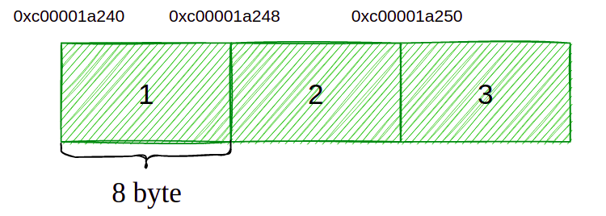

数组剖析
====

## 数组的概念
[数组(array)](https://go.dev/ref/spec#Array_types "Go Specification-Array types")是**单一类型**元素的编号序列，元素的个数称为数组的长度，长度不能为负数。 

## 数组的初始化方式
```go
// 显式指定数组大小，长度为3
var a = [3]int{1,2,3} 

// 让编译器自动推导数组大小，长度为3
var b = [...]int{4,5,6} 
```
创建数组时可以不显式初始化数组元素,比如`array := [10]int{}`，如果不显示指定数组的内容，则数组的默认内容为该类型的零值。在本例中，该数组的长度为10，数组的内容为10个0。  

ab两种初始化方式在运行期间是等价的，只不过a的类型在编译进行到类型检查阶段就确定了。而b则是在后续阶段由编译器推导数组的大小。最终使用NewArray函数生成数组。有关数组创建过程的更多细节，可以参考[《Draveness - 数组的实现原理》](https://draveness.me/golang/docs/part2-foundation/ch03-datastructure/golang-array "数组的实现原理")

## 数组的类型
数组的长度也是类型的一部分，也就是说，下面两个数组不是同一种类型
```go
a := [3]int{}
b := [4]int{}
a = b // 编译错误：cannot use b (type [4]int) as type [3]int in assignment
```
尽管a和b两个数组的元素类型都为`int`,但它们的长度不同，所以不属于同一种类型，不能相互比较和赋值。

## 数组的内存分配
数组在内存中是由一块连续的内存组成的。

```go
arr := [3]int{1, 2, 3}
fmt.Println(&arr[0]) // 0xc00001a240
fmt.Println(&arr[1]) // 0xc00001a248
fmt.Println(&arr[2]) // 0xc00001a250
// 十六进制表示，在我的64位机器上，int默认占用64位，即8字节，所以每次+8
```
图示如下：

  
使用`go tool compile -S main.go`查看汇编代码：
```ASM
LEAQ    type.[3]int(SB), AX
...
MOVQ    $1, (AX)
MOVQ    $2, 8(AX)
MOVQ    $3, 16(AX)
```
上面的汇编结果省去了部分内容，MOV指令的后缀是Q，而三行MOV指令的偏移量为8，从上面的汇编我们可以得到以下结论：**数组的长度为3，元素所占空间为8字节，中间没有内存空洞或者其他内容，是连续的**。


## 数组在内存中的位置
若不考虑逃逸分析，数组的长度**小于等于4**时数组会被分配至栈上，否则则会分配到静态区并在运行时取出，源码可以在`cmd/compile/internal/gc.anylit`中找到。 

结合逃逸分析的情况下，若数组没有被外部引用，则情况同上。若数组被外部引用，则分配至堆上。例如:函数返回数组指针，或数组作为slice底层的引用数组，且slice被外部引用，则slice底层引用的数组也会逃逸到堆上进行分配。

## 数组的访问
我们知道，数组是有长度的，那么如果我们试图访问超出长度的下标，会发生什么事呢？  
这里分为两种情况
- **编译期能够确定访问位置的情况**
- **编译期间不能确定访问位置的情况**  

假设有以下代码
```go
func foo() int{
    arr := [3]int{1,2,3}
    return arr[2]
}

// 调用时传入2,即foo(2)
func bar(i int) int{
    arr := [3]int{1,2,3}
    return arr[i]
}
```
这两段代码都是可以通过编译的，但编译器对两段代码的处理是不同的。`foo`函数在编译期就可以确定是否越界访问，如果把`return arr[2]`改为`return arr[4]`,你将得到一个编译错误：
>invalid array index 4 (out of bounds for 3-element array)  

但bar函数在编译时无法确定是否越界，因此需要运行时(runtime)的介入，使用`GOSSAFUNC=bar go build main.go`来查看bar函数start阶段的SSA指令。
```SSA
  ...
  v24 (23) = LocalAddr <*[3]int> {arr} v2 v23
  v25 (23) = IsInBounds <bool> v6 v14
If v25 → b2 b3 (likely) (23)
b2: ← b1-
  v28 (23) = PtrIndex <*int> v24 v6
  v29 (23) = Copy <mem> v23
  v30 (23) = Load <int> v28 v29
  v31 (23) = MakeResult <int,mem> v30 v29
Ret v31 (+23)
b3: ← b1-
  v26 (23) = Copy <mem> v23
  v27 (23) = PanicBounds <mem> [0] v6 v14 v26
Exit v27 (23)
...
```
**注意看v25这一行**,编译器插入了一个`IsInBounds`指令用来判断是否越界访问，如果越界则执行b3里的内容，触发panic。

## 数组的比较
如果数组的元素类型可以相互比较，那么数组也可以。比如两个**长度相等**的int数组可以进行比较，但两个长度相等的map数组就不可以比较，因为map之间不可以互相比较。
```go
var a, b [3]int
fmt.Println(a == b) // true

var c,d map[string]int
fmt.Println(c == d) // invalid operation: c == d (map can only be compared to nil)
```
## 数组的传递
Go中所有的内容都是值传递[](https://go.dev/doc/faq#pass_by_value "Go中的值传递")，因此赋值/传参/返回数组等操作都会将整个数组进行复制。更好的方式是使用slice，这样就能避免复制大对象所带来的开销。
```go
func getArray() [3]int {
	  arr := [3]int{1,2,3}
	  fmt.Printf("%p\n",&arr) // 0xc00001a258
	  return arr
}

func main() {
	  arr := getArray()
	  fmt.Printf("%p\n",&arr) // 0xc00001a240
}
```
可以发现,arr在返回前和返回后的地址是不相同的。


## 编译时的数组
// TODO: 整理此部分内容  

`arr := [3]int{1,2,3}`在第三阶段类型检查前的语法树为:
<details>

```json
{
    "op":"ir.OAS",
    "X":{
        "op":"ir.ONAME",
        "sym":{"Name":"arr"},
        "Ntype":nil
    },
    "Y":{
        // Type{List} (composite literal, not yet lowered to specific form)
        "op":"ir.OCOMPLIT",
        // ir.ArrayType struct
        "Ntype":{
            //  An ArrayType represents a [Len]Elem type syntax. If Len is nil, the type is a [...]Elem in an array literal.

            // [8]int or [...]int
            "op":"ir.OTARRAY",
            "Len":{
                "op":"ir.OLITERAL",
                "typ":{
                    // 
                    "kind":"types.TIDEAL",
                }
            },
            "Elem":{
                "op":"ir.ONONAME",
                "sym":{"Name":"int"}
            }
        },
        "List":[
            {"op":"ir.OLITERAL","val":1},
            {"op":"ir.OLITERAL","val":2},
            {"op":"ir.OLITERAL","val":3}
        ]
    }
}
```
</details>
经过第三阶段检查后变为:
<details>

```json
{
    "op":"ir.OAS",
    "X":{
        "op":"ir.ONAME",
        "sym":{"Name":"arr"},
        "Ntype":nil
    },
    "Y":{
        // Type{List} (composite literal, Type is array)
        "op":"ir.OARRAYLIT", 
        // type.Type struct
        "typ":{
            // types.Array struct
            "Extra":{
                // type.Type struct
                "Elem":{
                    "Width":8,
                    "kind":"types.TINT",
                    "Align":8,
                },
                "Bound":3
            },
            "Width":24,
            "kind":"types.TARRAY",
            "Align":8,
        },
        "Ntype":nil,
        "List":[
            {"op":"OLITERAL","val":1,"Width":8},
            {"op":"OLITERAL","val":2,"Width":8},
            {"op":"OLITERAL","val":3,"Width":8},
        ],
        "Len":0
    }
}
```
</details>

`arr := [...]int{1, 2, 3}`在第3阶段类型检查前的语法树
用JSON形式表示为:
<details>

```json
{
    "op":"ir.OAS",
    "X":{
        "op":"ir.ONAME",
        "sym":{"Name":"arr"},
        "Ntype":nil
    },
    "Y":{
        // Type{List} (composite literal, not yet lowered to specific form)
        "op":"ir.OCOMPLIT",
        // ir.ArrayType struct
        "Ntype":{
            //  An ArrayType represents a [Len]Elem type syntax. If Len is nil, the type is a [...]Elem in an array literal.

            // [8]int or [...]int
            "op":"ir.OTARRAY",
            "Len":nil,
            "Elem":{
                "op":"ir.ONONAME",
                "sym":{"Name":"int"}
            }
        },
        "List":[
            {"op":"ir.OLITERAL","val":1},
            {"op":"ir.OLITERAL","val":2},
            {"op":"ir.OLITERAL","val":3}
        ]
    }
}
```
</details>

经过类型检查第三阶段后，语法数变为:
<details>

```json
{
    "op":"ir.OAS",
    "X":{
        "op":"ir.ONAME",
        "sym":{"Name":"arr"},
        "Ntype":nil
    },
    "Y":{
        // Type{List} (composite literal, Type is array)
        "op":"ir.OARRAYLIT", 
        // type.Type struct
        "typ":{ // tcArray
            // types.Array struct
            "Extra":{
                // type.Type struct
                "Elem":{
                    "Width":8,
                    "kind":"types.TINT",
                    "Align":8,
                },
                "Bound":3
            },
            "Width":24,
            "kind":"types.TARRAY",
            "Align":8,
        },
        "Ntype":nil,
        "List":[
            {"op":"OLITERAL","val":1,"Width":8},
            {"op":"OLITERAL","val":2,"Width":8},
            {"op":"OLITERAL","val":3,"Width":8},
        ],
        "Len":0
    }
}
```
</details>

`[...]int{}`类型的处理逻辑在`typecheck.tcCompLit`函数中。
数组在编译时的节点表示为`ir.OTARRAY`,我们可以在类型检查阶段找到对该节点的处理: 

```go
// typecheck1 should ONLY be called from typecheck.
func typecheck1(n ir.Node, top int) ir.Node {
    ...
    switch n.Op() {
        ...
        case ir.OTARRAY:
            n := n.(*ir.ArrayType)
            return tcArrayType(n)
        ...
    }
}
```
我们将`tcArrayType`的关键节点放在下面:
```go
func tcArrayType(n *ir.ArrayType) ir.Node {
    if n.Len == nil { // [...]T的形式
        // 如果长度是...会直接返回，等到下一阶段进行处理
        return n
    }

    // 检查数组长度是否合法(大小/长度/是否为负数等)
    // ...

    // 确定数组类型
    bound, _ := constant.Int64Val(v)
    t := types.NewArray(n.Elem.Type(), bound)
    n.SetOTYPE(t)
    types.CheckSize(t)
    return n
}
```
如果直接使用常数作为数组的长度，那么数组的类型在这里就确定好了。  
如果使用`[...]T`+字面量这种形式,则会在`typecheck.tcCompLit`函数中确认元素的数量，并将其op更改为`ir.OARRAYLIT`以便于之后阶段使用

```go
func tcCompLit(n *ir.CompLitExpr) (res ir.Node) {
    ...
    // Need to handle [...]T arrays specially.
    if array, ok := n.Ntype.(*ir.ArrayType); ok && array.Elem != nil && array.Len == nil {
        array.Elem = typecheckNtype(array.Elem)
        elemType := array.Elem.Type()
        if elemType == nil {
            n.SetType(nil)
            return n
        }
        length := typecheckarraylit(elemType, -1, n.List, "array literal")
        n.SetOp(ir.OARRAYLIT)
        n.SetType(types.NewArray(elemType, length))
        n.Ntype = nil
        return n
    }
    ...
}
```
TODO:
